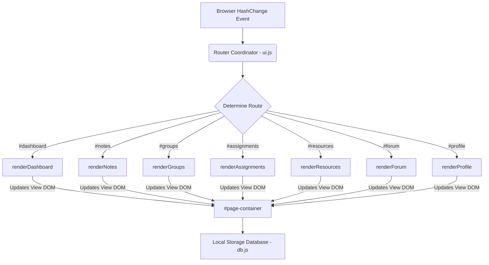

# 🎓 StudySphere — Student Collaboration & Productivity Platform

[](http://makeapullrequest.com)
[](https://www.firsttimersonly.com/)
[](LICENSE)
[](CONTRIBUTING.md)

StudySphere is a modern, responsive student productivity and collaboration platform. Built entirely with **Vanilla HTML5, CSS3, and JavaScript (ES6)**, it has **zero dependencies and zero build steps**, making it the **ideal playground for first-time open-source contributors** to practice Git, HTML, CSS, and JS.

---

## 🌟 Why Contribute Here?

- **Zero Configuration**: No `npm install`, no Webpack, no node module headaches. Just clone and open `index.html`.
- **Vanilla Stack**: Focus purely on writing clean CSS and JavaScript without learning complex frameworks.
- **Welcoming Community**: All pull requests (even documentation typos or code comments) are valued and reviewed helper-first.
- **Interactive Sandbox**: The application features persistence through Local Storage, allowing you to build dynamic features right inside the browser.

---

## 🗺️ Contribution Roadmap (Find Your Task!)

We have categorized features by difficulty level. Choose an issue that fits your skill set or create a new proposal!

### 🟢 Good First Issues (Beginner)
* **Visual Tweaks & Dark Mode Refinement**: Enhance the HSL palettes or glassmorphism blur in `css/style.css`.
* **Micro-Animations**: Add hover animations on stats cards, note bookmarks, or sidebar links.
* **Predefined Avatars**: Add more vector or pixel art avatars to the profile selector array in `js/pages.js`.
* **Documentation**: Correct typos, improve code comments, or translate the README.

### 🟡 Intermediate Tasks (JavaScript & State)
* **Markdown Parser**: Integrate a lightweight markdown parser (like `marked.js` via CDN) to render notes nicely instead of using raw text.
* **Interactive Quiz/Flashcards**: Create a study widget that lets students generate multiple-choice quizzes and test themselves.
* **Attendance Log**: Build a simple dashboard tracker to log weekly class attendance.
* **Backup & Export**: Add a button on the profile page to export local storage data to a JSON file and import it back.

### 🔴 Advanced Challenges (Architecture & Integrations)
* **Calendar Integration**: Implement a full calendar grid view that populates dots on days containing assignment deadlines.
* **Offline Support (PWA)**: Register a Service Worker to turn StudySphere into an installable progressive web app.
* **Supabase / Firebase Integration**: Bridge `js/db.js` storage calls to a cloud database for true remote multi-user sync.

---

## 📂 Codebase File Map

To help you find where to make your changes, here is a directory breakdown:

```text
StudyFlow/
├── index.html            # Main SPA frame containing sidebar & header wrapper
├── css/
│   ├── style.css         # CSS Variables (themes), global layouts, buttons, forms, & modals
│   └── pages.css         # Page-specific styling (Grids, widget items, thread timelines)
├── js/
│   ├── db.js             # LocalStorage wrapper, database API, & initial mock data
│   ├── ui.js             # Route coordinator (hash-based router), toast alerts, & modal states
│   └── pages.js          # Main engine injecting HTML view templates and handling UI events
├── .github/
│   └── ISSUE_TEMPLATE/   # Pre-configured templates for bugs and enhancements
├── CONTRIBUTING.md       # Full workflow guide for clone, branch, commit, and PR processes
├── CODE_OF_CONDUCT.md    # Code of Conduct details
└── LICENSE               # MIT Open Source license
```

---

## 🎨 Visual Architecture

StudySphere is structured as a client-side Single Page Application (SPA). The hash-based router acts as the coordinator:



---

## 💻 Local Development Setup

Setting up your environment takes less than a minute:

1. **Fork and Clone**:
   ```bash
   git clone https://github.com/YOUR_USERNAME/StudyFlow.git
   cd StudyFlow
   ```
2. **Run a Local Server** (Optional, but recommended for loading icons and avoiding CORS issues):
   - **Python 3**:
     ```bash
     python -m http.server 8000
     ```
     Open `http://localhost:8000` in your browser.
   - **NodeJS (`npx`)**:
     ```bash
     npx http-server -p 8000
     ```
     Open `http://localhost:8000` in your browser.
   - **VS Code Extension**: Right-click `index.html` and choose **Open with Live Server**.

---

## 🤝 Contribution Git Workflow

1. Search the **Issues** tab to find a task or open a new one to discuss your ideas.
2. Create a clean branch from `main`:
   ```bash
   git checkout -b feat/your-feature-name
   ```
3. Implement your changes. Please keep code formatted and write comments where needed.
4. Test your changes locally in dark and light modes, and verify responsive states on mobile.
5. Commit and push:
   ```bash
   git add .
   git commit -m "feat: add user flashcard quiz widget"
   git push origin feat/your-feature-name
   ```
6. Submit a **Pull Request** explaining what changes were made, how they were tested, and linking the issue.

---

## ❤️ Contributors

Thank you to everyone helping make StudySphere a better platform!

<!-- ALL-CONTRIBUTORS-LIST:START - Do not remove or modify this section -->
<!-- placeholder for contributors grid -->
<!-- ALL-CONTRIBUTORS-LIST:END -->

Contributions of any size are welcome! Please check [CONTRIBUTING.md](CONTRIBUTING.md) for more details.
