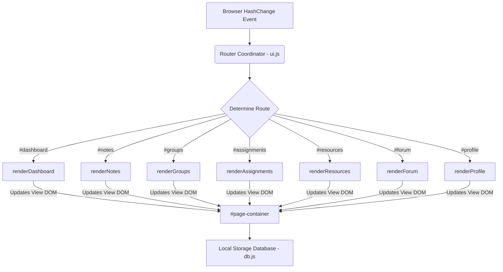

# StudySphere - Student Collaboration & Productivity Platform

StudySphere is a modern, responsive, and feature-rich collaborative dashboard designed to help students learn, organize, and connect in one place. Built entirely with pure **HTML, CSS, and JavaScript**, StudySphere provides a premium experience with a sleek glassmorphic user interface, smooth micro-animations, and client-side data persistence.

## 🚀 Key Features

- **Dashboard**: Get an immediate snapshot of your study statistics, approaching assignments, active study circles, and recent notes.
- **Student Profile Management**: Create and customize your academic identity, edit bio, manage skill tags, select avatars, and view all bookmarks.
- **Note Sharing System**: Share notes with peers. Includes full CRUD (create, read, update, delete) operations, live search and filter, in-browser viewing, bookmarking, and file downloads.
- **Study Groups**: Create and manage collaborative study rooms. Easily join/leave groups, track schedules, and click meeting links.
- **Assignment Tracker**: Track your academic deadlines with completion bars, status selectors, and priority categories.
- **Approaching Deadline Alerts**: Get active notifications for deadlines due within 48 hours.
- **Resource Library**: Bookmark and share cheatsheets, video lectures, coding tools, and tutorials. Filterable by category.
- **Discussion Forums**: Post academic questions, reply to active threads, upvote replies, and filter threads by categories.
- **Vibrant Themes**: Fluid toggle between sleek cyberpunk dark mode and clean glassmorphic light mode.
- **Local Storage Database**: Full client-side persistence for zero-friction local testing.

## 🛠️ Technology Stack

- **Structure**: Semantic HTML5 for modern SEO and structure.
- **Styling**: Custom Vanilla CSS3 using custom properties (Variables), flexible grids, flexbox, and glassmorphic designs.
- **Functionality**: Vanilla JavaScript (ES6) for state management, client-side routing, notifications, and CRUD database layer.
- **Icons**: Lucide Icons CDN.
- **Data Store**: HTML5 Local Storage.

---

## 🎨 Visual Architecture

The application is structured as a client-side Single Page Application (SPA) utilizing a hash-based router:



---

## 💻 Getting Started

Since StudySphere does not require Node.js or compilations, starting is extremely simple:

1. **Clone the Repository**:
   ```bash
   git clone https://github.com/amitpaul2004/StudyFlow.git
   cd StudyFlow
   ```
2. **Open index.html**:
   - Double-click `index.html` in your file browser.
   - Or run a simple python server to load icons without cross-origin issues:
     ```bash
     python -m http.server 8000
     ```
     Navigate to `http://localhost:8000`.

---

## 🗺️ Roadmap & Future Enhancements

We welcome community members to help us build out the following advanced components:
- [ ] **Collaborative Live Editor**: Real-time shared notes editing (using WebSockets or Yjs).
- [ ] **Attendance Tracker & Log**: Simple dashboard to track lecture and lab attendance.
- [ ] **AI Study Recommendation Engine**: Auto-suggest resources and study groups based on skills listed in your profile.
- [ ] **Interactive Quiz Generator**: MCQ card generator to quiz peers.
- [ ] **Calendar Integration**: Drag-and-drop calendar view showing upcoming assignment dates.
- [ ] **PWA Support**: Service workers setup for offline compatibility.
- [ ] **Backend Cloud Integration**: Supabase or Firebase authentication and remote DB synchronization.

---

## 🤝 Contributing

Contributions make the open-source community an amazing place to learn and build! Check out our [Contributing Guidelines](CONTRIBUTING.md) to get started on simple issues.

## 📄 License

Distributed under the MIT License. See [LICENSE](LICENSE) for details.
